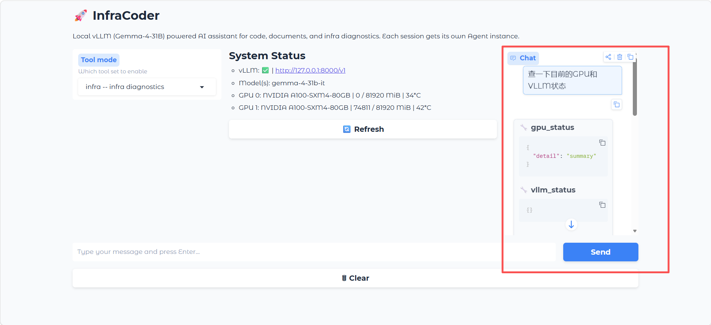
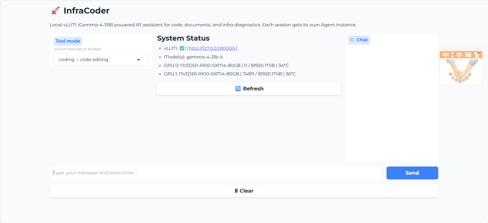

<div align="center">

# InfraCoder

**兼容本地 vLLM 与云端 API 的轻量级 AI Agent** · 代码修改 · 文档处理 · AI Infra 诊断

</div>

## 项目概述

InfraCoder 是一个兼容本地 vLLM 与云端 API 的轻量级 AI Agent。它打通了从 **GPU 基础设施 / vLLM 推理服务 → OpenAI-Compatible API → Agent 应用** 的完整链路，让同事可以通过浏览器或命令行直接使用任意 OpenAI-Compatible 模型（包括本地部署的 vLLM、云端 DeepSeek / OpenAI 等）来完成代码修改、文档处理和 AI 基础设施诊断等任务。

### 核心能力

- **代码修改**：读写文件、代码搜索替换、Bash 执行、子 Agent 调度
- **文档处理**：文本文件的读取、编辑、搜索
- **AI Infra 诊断**：GPU 状态实时检测、vLLM 服务健康检查
- **多模式工具权限**：按任务类型自动裁剪工具集
- **Web UI 多人访问**：基于 Gradio，每个会话独立隔离

---

## 系统架构

### Agent 核心循环

InfraCoder 的核心是一个 **while 循环**，流程如下：

```
1. 用户输入 → 2. LLM 处理 → 3. 模型返回文本或工具调用请求
                                        ↓
                             4. 执行工具 → 5. 结果回填 → 6. 回到步骤2
```

关键实现（`infracoder/agent.py`）：

```
while True:
    response = llm.chat(messages, tools=tool_defs)    # 调模型
    messages.append(response)                           # 追加回复
    if response.tool_calls:                             # 工具调用
        results = execute_tools(response.tool_calls)    # 并行执行
        messages.extend(results)                        # 结果回填
    else:
        return response.text                            # 返回最终回答
```

这就是 Agent 最本质的形态。循环本身只有几十行代码，真正让它能稳定工作的，是围绕这个循环构筑的支撑体系：

- **LLM 接口层**（`llm.py`）：统一封装 OpenAI-Compatible API，处理流式返回、工具调用参数拼接、重试退避、用量统计
- **上下文管理**（`context.py`）：三级压缩策略，确保长对话不超出模型窗口限制
- **会话持久化**（`session.py`）：保存/恢复对话状态
- **工具系统**（`tools/`）：每个工具是一个独立模块，通过统一基类注册

### 工具系统

所有工具继承自 `Tool` 基类（`infracoder/tools/base.py`），每个工具需要定义：

- **name**: 工具名称（LLM 通过名称调用）
- **description**: 描述（LLM 理解工具用途的依据）
- **parameters**: JSON Schema 参数定义
- **execute()**: 实际执行逻辑

当前工具集：

| 工具 | 功能 | 来源 |
|------|------|------|
| `read_file` | 读取文件内容 | 参考改善 |
| `write_file` | 写入文件 | 参考改善 |
| `edit_file` | 搜索替换式代码编辑 | 参考改善 |
| `bash` | 执行 Shell 命令（含危险命令检测） | 参考改善 |
| `grep` | 文本内容搜索 | 参考改善 |
| `glob` | 文件名匹配搜索 | 参考改善 |
| `agent` | 子 Agent 调度（隔离上下文执行子任务） | 参考改善 |
| `gpu_status` | NVIDIA GPU 状态检测（显存、利用率、温度、功耗、进程、拓扑） | 自定义工具 |
| `vllm_status` | vLLM 服务健康度检查（模型列表、API 响应延迟、端点可用性） | 自定义工具 |


*Agent 系统架构与工具系统*

### 模式系统（Mode System）

模式系统的设计思路是：**不同任务场景需要不同的工具权限**。`infracoder/modes.py` 定义了四种模式：

| 模式 | 适用场景 | 可用工具 |
|------|----------|----------|
| `review` | 代码审查 | read_file, grep, glob（只读） |
| `coding` | 代码修改 | read/write/edit/bash + 搜索 |
| `document` | 文档编辑 | read/write/edit + 搜索（无 bash） |
| `infra` | 基础设施诊断 | read, grep, glob + gpu_status, vllm_status（只读） |

通过 `/mode <name>` 命令切换模式后，Agent 可见的工具列表会立即改变，相当于给 LLM 限制了"能做什么事"的边界。

---

## 自定义工具详解

### GPU 状态工具（gpu_status）

读取 NVIDIA GPU 的实时状态，通过 nvidia-smi 获取以下信息：

- **基础信息**：GPU 型号、驱动版本、CUDA 版本
- **显存**：总显存、已用显存、显存利用率
- **利用率**：GPU 核心利用率
- **温度**：GPU 温度
- **功耗**：当前功耗、最大功耗
- **进程**：各 GPU 上运行的进程及显存占用
- **拓扑**：多卡间的 NVLink/PCIe 互联拓扑

提供四种详细级别：summary、processes、topology、all。

### vLLM 状态工具（vllm_status）

检测 vLLM 推理服务的健康状况，通过 HTTP 请求访问 vLLM API：

- **Models 端点**：检查 `/v1/models` 是否可达，返回已加载模型列表
- **Chat 端点**：检查 `/v1/chat/completions` 是否能正常推理
- **响应时间**：记录各端点请求耗时
- **配置检测**：读取当前环境变量中的 API 配置

该工具会自动检测 `OPENAI_BASE_URL` 和 `INFRACODER_BASE_URL` 环境变量中配置的 vLLM 地址。


*GPU 状态与 vLLM 健康检查工具演示*

---

## Web UI

基于 Gradio 6.x 构建的 Web 界面，部署在服务器上，部门同事可通过浏览器直接使用。

### 启动

```bash
cd /home/ubuntu/XYP/InfraCoder
source venv/bin/activate
./start_webui.sh start
```

### 访问

打开浏览器访问 `http://192.168.15.119:7860`

**特性**：
- 每个浏览器标签页拥有独立的 Agent 会话
- 模式选择器可在 full/coding/document/infra/review 间切换
- 实时状态面板展示 vLLM 健康和 GPU 指标
- 流式对话输出
- 工具调用过程可视化

### 管理

```bash
./start_webui.sh stop      # 停止
./start_webui.sh status    # 查看状态
```


*Web UI 运行界面*

---

## 多模型适配

在实际部署中，不同模型的 Chat Template、Tool Calling 格式、Reasoning（思维链）输出格式存在显著差异。InfraCoder 的 LLM 接口层（`llm.py`）统一处理了这些问题：

- **流式解析**：将流式返回的多个 chunk 按顺序拼合为完整消息
- **工具调用提取**：从模型回复中解析 tool_call_id、function name 和 arguments
- **重试策略**：429 限流和 5xx 服务端错误自动退避重试，4xx 客户端错误直接抛出
- **用量统计**：记录每次请求的 token 消耗和估算费用

---

## CLI 命令行

```bash
infracoder                              # 交互式 REPL
infracoder -p "修复 parse_config() 的错误处理"  # 一次性模式
infracoder --mode coding                # 指定模式启动
```

### 内置命令

| 命令 | 功能 |
|------|------|
| `/model <name>` | 切换模型 |
| `/mode <name>` | 切换模式（review/coding/document/infra） |
| `/compact` | 手动压缩上下文 |
| `/tokens` | 查看 token 用量和费用估算 |
| `/diff` | 本次会话修改的文件 |
| `/save` | 保存当前会话 |
| `/sessions` | 列出所有已保存会话 |

---

## 部署环境

- **GPU**：双卡 NVIDIA A100 80GB
- **推理引擎**：vLLM
- **已部署模型**：Qwen3-Coder-30B、Gemma-4-31B-it
- **网络**：内网 192.168.15.x 局域网
- **操作系统**：Ubuntu 22.04

---

## 实现原理

### 1. 从 Loop 到 Agent

Agent 的核心是一个 `while True` 循环：

```python
# 精简实现
messages = [system_prompt, user_message]
while turn < max_turns:
    response = llm.chat(messages, tools=tool_defs)
    if not response.tool_calls:
        break                           # 模型主动结束
    tool_results = parallel_execute(response.tool_calls)
    messages.extend(tool_results)       # 回填执行结果
```

这个设计的巧妙之处在于：**模型不需要知道工具的实现细节**，只需要根据描述和参数格式发起调用。工具执行结果以"新的系统消息"形式回填到上下文中，模型据此决定下一步行动。

### 2. 上下文压缩

长对话中，历史消息会迅速填满模型的窗口限制。InfraCoder 采用三级压缩策略：

1. **丢弃最早的工具调用细节**：保留用户-助手对话骨架，移除冗长的工具执行输出
2. **摘要旧消息**：将早期对话压缩为一两句摘要
3. **全量保留最近消息**：最近的 N 轮对话保持完整

### 3. 工具权限隔离

模式系统的本质是 **工具列表的白名单机制**。不同模式对应不同的工具子集，LLM 只能看到和调用当前模式允许的工具。这种设计与最小权限原则一致——审查代码时不需要执行命令的能力，诊断基础设施时也不需要修改文件的能力。

---

## 项目结构

```
InfraCoder/
├── infracoder/              # 核心包
│   ├── agent.py             # Agent 主循环
│   ├── llm.py               # LLM 接口封装
│   ├── context.py           # 上下文管理
│   ├── session.py           # 会话持久化
│   ├── cli.py               # 命令行界面
│   ├── config.py            # 配置管理
│   ├── prompt.py            # 系统提示词
│   ├── modes.py             # 模式系统
│   ├── __init__.py          # 包入口
│   ├── __main__.py          # python -m 入口
│   └── tools/               # 工具集合
│       ├── base.py          # Tool 基类
│       ├── bash.py          # Shell 执行
│       ├── read.py          # 文件读取
│       ├── write.py         # 文件写入
│       ├── edit.py          # 代码编辑
│       ├── grep.py          # 文本搜索
│       ├── glob_tool.py     # 文件名搜索
│       ├── agent.py         # 子 Agent
│       ├── gpu_status.py    # GPU 状态
│       └── vllm_status.py   # vLLM 健康
├── webui.py                 # Gradio Web 界面
├── start_webui.sh           # Web UI 启停脚本
├── tests/                   # 测试
├── assets/                  # 截图
├── pyproject.toml           # 包配置
├── README.md                # 本文档
└── .env                     # 环境变量配置
致谢：
InfraCoder 的 Agent 核心设计与部分基础工具实现受 CoreCoder 项目启发，为本项目的学习与开发提供了重要参考。
在此基础上，InfraCoder 进一步结合私有化大模型部署场景，扩展了本地 vLLM 接入、GPU/vLLM 基础设施诊断、多模式工具权限控制及 Gradio Web UI 等功能。
感谢所有开源项目作者与社区贡献者。作者联系方式（vx同步）：18300396393
