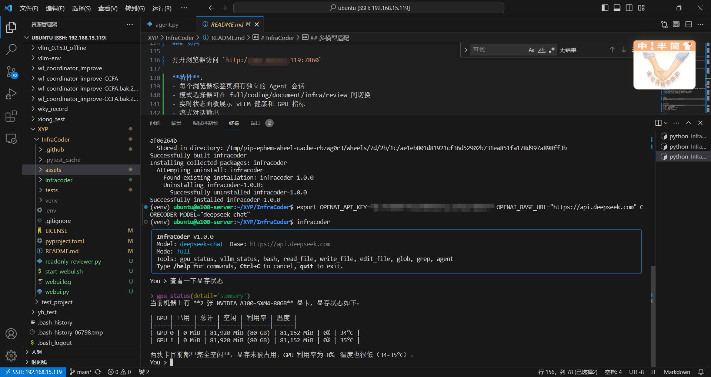

# InfraCoder

**兼容本地 vLLM 与云端 API 的轻量级 AI Agent** · 代码修改 · 文档处理 · AI Infra 诊断


## 缘起

实验室有几台异构 GPU 服务器——NVIDIA A100、天数智芯 BI-V150、沐曦 C500，平时同事跑实验、部署模型都在这几台机器上。GPU 显存被谁占了、vLLM 服务挂了没有、模型有没有正常加载——这些事每天都有人来问，有时候连我自己也搞不清楚，得 ssh 上去挨个敲 nvidia-smi 或者厂商自带的监控命令，再 curl 几个端点看看。

后来就想，与其每次手动排查，不如让一个 Agent 自己去查。正好当时在学 Agent 的实现原理，就拿这个场景当练手。结果越写越觉得有意思——从 nvidia-smi 的 csv 解析到 OpenAI 的 tool calling 协议，从流式 chunk 拼接到上下文窗口管理，一脚踩进去发现每个环节都有坑。

最后做出来的东西超出了最初"写个脚本查 GPU"的设想：它成了一个麻雀虽小五脏俱全的 AI Agent，支持命令行和 Web 两种交互方式，兼容本地 vLLM 和云端 API，部门同事可以直接在浏览器里用。这个文档记录了它是什么、怎么做的、以及踩过的一些坑。


## 项目概述

InfraCoder 是一个面向局域网私有化部署场景的 AI Agent。它打通了从 **GPU 硬件 → vLLM 推理服务 → OpenAI-Compatible API → Agent 应用** 的完整链路，让同事可以通过浏览器或命令行直接使用任意 OpenAI-Compatible 模型（包括本地部署的 vLLM、云端 DeepSeek / OpenAI 等）来完成代码修改、文档处理和 AI 基础设施诊断。

核心能力：

- **代码修改**：读写文件、代码搜索替换、Bash 执行、子 Agent 调度
- **文档处理**：文本文件的读取、编辑、搜索
- **AI Infra 诊断**：GPU 状态实时检测、vLLM 服务健康检查
- **知识库 RAG**：内部文档索引和语义搜索
- **工作流模板**：高频任务固化，一键执行
- **多模式工具权限**：按任务类型自动裁剪工具集
- **Web UI 多人访问**：基于 Gradio，每个会话独立隔离
- **用户个性化**：每个人有独立的模型偏好、输出风格、工具权限


## 系统架构

### Agent 核心循环

Agent 的核心是一个带上限的循环——不是 `while True`，是 `for _ in range(self.max_rounds)`，默认 50 轮。

这不是风格差异，是一道刹车。设想模型陷入一个它自己跳不出的循环：读文件、发现不对、再读、还是不对、再读。没有上限的话，它会一直烧 token，直到你手动 Ctrl+C 或者账单让你心疼。50 轮这个数字是经验值——正常任务远用不到，真撞到上限，循环会返回一句 `(reached maximum tool-call rounds)`，把控制权交还给你。

```
1. 用户输入 → 2. LLM 处理 → 3. 模型返回文本或工具调用请求
                                        ↓
                             4. 执行工具 → 5. 结果回填 → 6. 回到步骤2（最多 50 轮）
```

关键实现（`infracoder/agent.py`）：

```python
for _ in range(self.max_rounds):
    resp = self.llm.chat(
        messages=self._full_messages(),
        tools=self._tool_schemas(),
        on_token=on_token,
    )

    if not resp.tool_calls:          # 模型主动结束，返回文本
        self.messages.append(resp.message)
        return resp.content

    self.messages.append(resp.message)

    if len(resp.tool_calls) == 1:
        result = self._exec_tool(resp.tool_calls[0])
        self.messages.append({"role": "tool", "tool_call_id": tc.id, "content": result})
    else:
        results = self._exec_tools_parallel(resp.tool_calls)  # 多个工具调用并行执行
        for tc, result in zip(resp.tool_calls, results):
            self.messages.append({"role": "tool", "tool_call_id": tc.id, "content": result})

return "(reached maximum tool-call rounds)"
```

循环本身只有几十行代码。真正让它能稳定工作的，是围绕这个循环构筑的支撑体系：

- **LLM 接口层**（`llm.py`）：统一封装 OpenAI-Compatible API，处理流式返回、工具调用参数拼接、重试退避、用量统计
- **上下文管理**（`context.py`）：三级压缩策略，确保长对话不超出模型窗口限制
- **会话持久化**（`session.py`）：保存/恢复对话状态
- **工具系统**（`tools/`）：每个工具是一个独立模块，通过统一基类注册

### 工具系统

所有工具继承自 `Tool` 基类（`infracoder/tools/base.py`），每个工具需要定义：

- **name**：工具名称（LLM 通过名称调用）
- **description**：描述（LLM 理解工具用途的依据）
- **parameters**：JSON Schema 参数定义
- **execute()**：实际执行逻辑

当前工具集：

| 工具 | 功能 | 来源 |
|------|------|------|
| `read_file` | 读取文件内容，支持行号范围和分页 | 参考优化 |
| `write_file` | 创建或覆盖文件，自动创建父目录 | 参考优化 |
| `edit_file` | 精确字符串匹配替换，生成 unified diff | 参考优化 |
| `bash` | Shell 命令执行，含危险命令拦截和 cd 感知 | 参考优化 |
| `grep` | 正则内容搜索，自动跳过 .git 等目录 | 参考优化 |
| `glob` | 文件名模式匹配，按修改时间排序 | 参考优化 |
| `agent` | 子 Agent 调度，隔离上下文执行子任务 | 参考优化 |
| `search_knowledge` | 知识库语义搜索，支持关键词和 embedding 双模式 | 自研 |
| `workflow` | 预置工作流模板：GPU 诊断、代码审查、文档摘要、错误排查 | 自研 |
| `gpu_status` | GPU 状态检测（显存、利用率、温度、功耗、进程、拓扑） | 自研 |
| `vllm_status` | vLLM 服务健康度检查（模型列表、API 响应延迟、端点可用性） | 自研 |


*Agent 系统架构与工具系统*

### 模式系统

模式系统的设计思路很简单：**不同任务场景需要不同的工具权限**。`infracoder/modes.py` 定义了五种模式：

| 模式 | 适用场景 | 可用工具 |
|------|----------|----------|
| `review` | 代码审查 | read_file, grep, glob, search_knowledge（只读） |
| `coding` | 代码修改 | read/write/edit/bash + 搜索 |
| `full` | 所有功能 | 全部 11 个工具 |
| `document` | 文档编辑 | read/write/edit + 搜索（无 bash） |
| `infra` | 基础设施诊断 | read, grep, glob, search_knowledge + gpu_status, vllm_status（只读） |

通过 `/mode ` 命令切换模式后，Agent 可见的工具列表会立即改变，相当于给 LLM 限制了"能做什么事"的边界。

模式切换和用户配置互不干扰——切换模式不改变输出风格，切换用户不改变工具权限（除非用户配置了禁用工具）。


## 工作流模板系统

高频任务（GPU 诊断、代码审查、文档总结）如果每次让 LLM 自由发挥，输出格式不稳定且浪费 token。工作流模板把任务的执行步骤和输出格式固化下来，LLM 识别到匹配的模板就不再自由探索，直接按模板执行。

内置模板：

| 模板 | 说明 | 参数 |
|------|------|------|
| `gpu_check` | 完整 GPU 诊断：显存→温度→进程→拓扑→vLLM | 无 |
| `code_review` | 代码审查：glob→读文件→ruff→报告 | target |
| `doc_summarize` | 文档摘要：详细/简洁/要点三种风格 | file, style |
| `investigate_error` | 错误排查：搜索→读代码→定位根因→修复建议 | error, project |

```bash
# 调用示例
# LLM 会自动判断何时使用工作流模板
> 帮我对这个目录做一次代码审查
# LLM 调 workflow(template="code_review", params={"target": "src/"})
> 检查一下 GPU 状态
# LLM 调 workflow(template="gpu_check")
```

模板定义在 `infracoder/workflows/defaults.py` 中，每个模板是一个带 `{placeholder}` 的任务指令。通过 `workflow` 工具执行，内部创建子 Agent 按步骤执行。


## 自定义工具详解

### GPU 状态工具（gpu_status）

读取 GPU 的实时状态，通过 nvidia-smi 获取以下信息：

- **基础信息**：GPU 型号、驱动版本、CUDA 版本
- **显存**：总显存、已用显存、显存利用率
- **利用率**：GPU 核心利用率
- **温度**：GPU 温度
- **功耗**：当前功耗、最大功耗
- **进程**：各 GPU 上运行的进程及显存占用
- **拓扑**：多卡间的 NVLink/PCIe 互联拓扑

提供四种详细级别：summary、processes、topology、all。

### vLLM 状态工具（vllm_status）

检测 vLLM 推理服务的健康状况，通过 HTTP 请求访问 vLLM API：

- **Models 端点**：检查 `/v1/models` 是否可达，返回已加载模型列表
- **Chat 端点**：检查 `/v1/chat/completions` 是否能正常推理
- **响应时间**：记录各端点请求耗时
- **配置检测**：读取当前环境变量中的 API 配置

该工具会自动检测 `OPENAI_BASE_URL` 和 `INFRACODER_BASE_URL` 环境变量中配置的 vLLM 地址。

GPU 状态与 vLLM 健康检查⼯具演⽰

## RAG 知识库

LLM 只知道训练数据里的内容，不知道公司内部的文档、API 规范、项目约定。知识库系统让 Agent 可以通过搜索查询内部文档，基于搜到的内容回答问题。

```bash
# 索引文档到知识库
infracoder kb add company-docs/    # 索引整个目录
infracoder kb add README.md       # 索引单个文件

# 管理
infracoder kb list                 # 查看已索引的文档
infracoder kb stats                # 统计信息
infracoder kb rebuild              # 重建索引
```

Agent 自动判断是否需要查知识库——普通聊天直接回答，不确定时才调 `search_knowledge`。知识库数据存储在项目 `.infracoder/knowledge/_index.json` 中，重启不丢失。


## Web UI

基于 Gradio 6.x 构建的 Web 界面，部署在服务器上，部门同事可通过浏览器直接使用。

### 启动

```bash
cd /home/ubuntu/XYP/InfraCoder
source venv/bin/activate
./start_webui.sh start
```

### 访问

打开浏览器访问 `http://192.168.15.119:xxxx`

**特性**：
- 每个浏览器标签页拥有独立的 Agent 会话
- 模式选择器可在 full/coding/document/infra/review 间切换
- 实时状态面板展示 vLLM 健康和 GPU 指标
- 流式对话输出
- 工具调用过程可视化

### 管理

```bash
./start_webui.sh stop      # 停止
./start_webui.sh status    # 查看状态
```


*Web UI 运行界面*


## 多模型适配

在实际部署中，不同模型的 Chat Template、Tool Calling 格式、Reasoning 输出格式存在显著差异。InfraCoder 的 LLM 接口层（`llm.py`）统一处理了这些问题：

- **流式解析**：将流式返回的多个 chunk 按顺序拼合为完整消息
- **工具调用提取**：从模型回复中解析 tool_call_id、function name 和 arguments
- **双后端适配**：同时支持 OpenAI SDK 和 LiteLLM 两种后端，后者可路由到 100+ 模型提供商
- **重试策略**：429 限流和 5xx 服务端错误自动退避重试，4xx 客户端错误直接抛出
- **用量统计**：记录每次请求的 token 消耗和估算费用


## CLI 命令行

```bash
infracoder                              # 交互式 REPL
infracoder -p "修复 parse_config() 的错误处理"  # 一次性模式
infracoder --mode coding                # 指定模式启动
```

## 用户个性化配置

部门多人共用，每个人需要的模型、输出风格、工具权限各不相同。用户配置系统让每个人有独立的配置文件。

```
.infracoder/users/
├── 张伟.yaml     # 后端开发，detailed 风格，全工具
├── 王芳.yaml     # 测试，concise 风格，禁用 bash
├── 李强.yaml     # 运维，bullet 风格，纯诊断工具
├── 赵敏.yaml     # 文档编辑，default 风格，只改文档
├── 刘洋.yaml     # 实习生，detailed 风格，限制执行权限
└── xuyipeng.yaml # 默认用户
```

```bash
# 启动时指定用户
INFRACODER_USER=张伟 infracoder
INFRACODER_USER=王芳 infracoder

# 或写入 .zshrc 长期生效
export INFRACODER_USER=张伟
```

配置项：

| 配置 | 作用 | 生效位置 |
|------|------|---------|
| `preferred_model` | 模型偏好 | API 参数，不写进提示词 |
| `output_style` | 输出风格（concise/detailed/bullet） | system prompt 尾部追加 |
| `disabled_tools` | 禁用特定工具 | 启动时裁剪工具列表 |
| `preferred_language` | 语言偏好 | system prompt 中设置 |


### 内置命令

| 命令 | 功能 |
|------|------|
| `/model ` | 切换模型 |
| `/mode ` | 切换模式（review/coding/document/infra） |
| `/compact` | 手动压缩上下文 |
| `/tokens` | 查看 token 用量和费用估算 |
| `/diff` | 本次会话修改的文件 |
| `/save` | 保存当前会话 |
| `/sessions` | 列出所有已保存会话 |
| `/kb ` | 知识库管理：add, list, remove, rebuild, stats |
| `/profile` | 查看当前用户个性化配置 |


## 部署环境

- **GPU**：NVIDIA A100 80GB、天数智芯 BI-V150、沐曦 C500 等异构 GPU
- **推理引擎**：vLLM
- **已部署模型**：Qwen3-Coder-30B、Gemma-4-31B-it 等十余种模型
- **网络**：内网 192.168.15.x 局域网
- **操作系统**：Ubuntu 22.04


## 实现原理

InfraCoder 总共约 1000 行核心 Python 代码，分为 13 个模块。下面按模块逐一说明设计思路和实现要点。

### agent.py — Agent 主循环

Agent 的核心是一个 `for _ in range(self.max_rounds)` 循环，默认上限 50 轮。每轮：调用 LLM → 如果返回文本就结束 → 如果有 tool_calls 就执行工具 → 将结果回填到消息历史 → 继续下一轮。

几个关键设计：

- **并行工具执行**：当模型一次发起多个工具调用时，用 `ThreadPoolExecutor`（最多 8 线程）并发执行，因为同批工具调用之间没有依赖关系
- **中断安全**：`KeyboardInterrupt` 时，`_answer_pending_tool_calls` 方法会为所有未完成 tool_call 回填占位消息——OpenAI 兼容 API 要求每条 tool 消息前必须有对应的 assistant 消息，否则下次请求会被拒绝
- **模式切换**：`set_mode()` 方法重建 `_tool_by_name` 映射和 system prompt，同时重新绑定子 Agent 的父引用

### llm.py — LLM 接口封装

统一封装 OpenAI-Compatible API，提供 `LLM`（OpenAI SDK）和 `LiteLLM`（LiteLLM SDK）两个后端。核心职责：

- **流式消费**：将 SSE 流中的多个 chunk 按 index 累积 tool_calls 的 id、name 和 arguments（因为 tool call 的参数可能跨多个 chunk 传输）
- **重试退避**：`_call_with_retry` 方法在 429 / 5xx / 超时 / 连接错误时指数退避重试最多 3 次，4xx 客户端错误直接抛出
- **费用估算**：内置 GPT-5.5、DeepSeek、Claude、Qwen、Kimi 等主流模型的定价表，按 token 用量估算费用
- **stream_options 兼容**：部分自建 vLLM 服务不支持 `stream_options` 参数，先用该参数请求，遇到 400 错误自动回退

### context.py — 上下文管理

长对话中，消息历史会迅速接近模型的上下文窗口上限。`ContextManager` 提供三级压缩，按占比触发：

1. **第一级（50% 窗口）**：`_snip_tool_outputs` 截断超过 1500 字符的 tool 输出，保留首尾关键行
2. **第二级（70% 窗口）**：`_summarize_old` 用 LLM 将早期对话压缩为一两句摘要，保留最近 8 轮完整消息
3. **第三级（90% 窗口）**：`_hard_collapse` 硬清空——只保留摘要和最近 N 轮，其余全部丢弃

`_split_point` 方法确保 tool 消息永远不会与它所属的 assistant 消息被拆散——OpenAI 兼容 API 要求每条 tool 消息前面必须有对应的 tool_calls，否则请求会被拒绝。

如果 LLM 不可用，摘要会回退到 `_extract_key_info` 方法：从消息中提取文件路径和错误信息组成简要摘要。

### session.py — 会话持久化

将对话历史保存为 JSON 文件，支持 resume 恢复。安全措施：

- **路径穿越防护**：`_session_path` 方法用 `resolve()` 后检查父目录是否等于 `SESSIONS_DIR`，防止 `../../etc/passwd` 这类攻击
- **非法字符过滤**：session ID 只保留 `[A-Za-z0-9._-]`，长度上限 100 字符
- **自动命名**：未指定 ID 时用 `session_时间戳_随机hex` 格式生成

### config.py — 配置管理

`Config` 数据类从环境变量读取配置，支持 `.env` 文件。`_load_dotenv` 会从 cwd 向上遍历目录树查找 `.env` 文件，方便在不同工作目录下启动时自动加载配置。环境变量兼容 `INFRACODER_*` 和 `CORECODER_*` 两种前缀，同时回退到 `OPENAI_API_KEY` 等通用变量。

### prompt.py — 系统提示词

`system_prompt(tools, style=None)` 函数动态生成系统提示词，支持个性化输出风格参数，包含当前工作目录、操作系统、Python 版本、可用工具列表和 8 条行为规则。每次切换模式时会重新生成，确保 LLM 看到的工具列表与实际可用工具一致。

### modes.py — 模式系统

定义了五种模式的工具白名单（`MODE_TOOLS` 字典）。`get_tools_for_mode(mode)` 根据模式名返回对应的工具实例列表，`full` 模式返回全部工具。模式名不区分大小写，未知模式抛 `ValueError`。

### cli.py — 命令行界面

基于 `prompt_toolkit` 和 `rich` 构建的交互式 REPL。支持：

- 多行输入（Enter 提交，Esc+Enter 换行）
- 11 个内置命令（含 `/kb`、`/profile`）（`/model`、`/mode`、`/compact`、`/tokens`、`/diff`、`/save`、`/sessions`、`/reset`、`/help`）
- 一次性模式（`-p` 参数）
- 会话恢复（`-r` 参数）
- 流式输出和工具调用过程可视化

### webui.py — Gradio Web 界面

基于 Gradio 6.x 构建，每个浏览器标签页通过 `gr.State` 维护独立的 Agent 实例。`_system_status` 函数实时查询 vLLM 模型列表和 GPU 状态，显示在侧边栏。`_chat_impl` 处理流式对话，工具调用过程以灰色小字展示在消息中。

### tools/ 工具模块

**base.py** — `Tool` 抽象基类，定义 `name`、`description`、`parameters` 三个属性和 `execute()`、`schema()` 两个方法。`schema()` 返回 OpenAI function-calling 格式的 JSON Schema。

**read.py** — `ReadFileTool`，读取文件内容带行号，支持 offset 和 limit 分页，默认显示 2000 行。UTF-8 解码失败时用 `errors="replace"` 容错。

**write.py** — `WriteFileTool`，创建或覆盖文件，自动创建父目录。写入后记录到 `_changed_files` 集合供 `/diff` 命令使用。

**edit.py** — `EditFileTool`，通过精确字符串匹配替换实现代码编辑。`old_string` 必须在文件中恰好出现一次，出现 0 次或多次都报错，确保编辑安全。成功后生成 unified diff 返回。

**bash.py** — `BashTool`，执行 Shell 命令。内置 12 种危险命令正则拦截（`rm -rf /`、`mkfs`、`dd`、fork bomb、`curl | sh` 等），支持超时控制、输出截断（保留首尾）、以及跨命令的 `cd` 目录追踪（线程局部变量实现）。

**grep.py** — `GrepTool`，正则搜索文件内容，自动跳过 `.git`、`node_modules`、`__pycache__` 等目录，结果上限 200 条匹配。跳过规则只检查 `relative_to(root)` 的路径部分，避免祖先目录名命中规则导致整个搜索树被隐藏。

**glob_tool.py** — `GlobTool`，文件名模式匹配，支持 `**` 递归搜索，按修改时间倒序排列，最多返回 100 条。

**agent.py** — `AgentTool`，子 Agent 调度。创建独立的 Agent 实例（排除自身 agent 工具防止无限递归），独立上下文执行子任务，结果截断到 5000 字符后返回给父 Agent。

### workflows/ 工作流包

`WorkflowTemplate` 数据类包含 name、description、parameters（JSON Schema）、instruction（带 `{placeholder}` 的任务指令）。`WorkflowTool` 继承 `Tool` 基类，注册为普通工具。模板从 `defaults.py` 加载，4 个内置模板涵盖 GPU 诊断、代码审查、文档摘要、错误排查。

### knowledge/ 知识库包

`KnowledgeBase` 类管理文档索引和搜索。文档按段落切块（每块 100-2000 字符），提取关键词后存为 JSON 索引。搜索时优先尝试 embedding 语义搜索（通过 config 中配置的 API），回退到关键词匹配。支持的文件类型：`.md`、`.txt`、`.py`、`.rst`、`.yaml`、`.json`。通过 `infracoder kb` 子命令管理。

### user_config.py — 用户个性化配置

`UserConfig` 类从 `.infracoder/users/<用户名>.yaml` 读取配置，支持 preferred_model、output_style、disabled_tools 等字段。`init_user_config()` 自动检测系统用户名或 `INFRACODER_USER` 环境变量，第一次启动时自动生成配置模板。

**gpu_status.py** — `GPUStatusTool`，自研工具。通过 `nvidia-smi --query-gpu` 获取 GPU 型号、UUID、驱动版本、温度、利用率、显存、功耗，通过 `nvidia-smi --query-compute-apps` 获取 GPU 进程，通过 `nvidia-smi topo -m` 获取拓扑。提供 summary / processes / topology / all 四种详细级别，输出按 Markdown 格式化。

**search_knowledge.py** — `SearchKnowledgeTool`，知识库语义搜索。通过关键词匹配搜索已索引的文档块，返回最相关的内容。支持双模式：内置关键词搜索（无需额外依赖）和 embedding 语义搜索（如 LLM 后端支持）。

**workflow.py** — `WorkflowTool`，预置工作流模板执行。根据模板名和参数创建子 Agent 执行模板中定义的任务步骤。模板支持参数占位符和条件分支。

**vllm_status.py** — `VLLMStatusTool`，自研工具。通过 HTTP GET 检查 `/v1/models` 端点，通过 POST 空请求检查 `/v1/chat/completions` 端点（先获取模型名再构造最小请求），记录响应时间，同时读取环境变量中的 API 配置。所有异常（HTTP 错误、连接失败）都被捕获并格式化为可读的诊断报告。

### tests/ 测试

- **test_core.py**：token 估算（`estimate_tokens` 和 `_approx_tokens`）、上下文压缩（`_snip_tool_outputs` 和 `maybe_compress`）
- **test_tools.py**：11 个工具（含 search_knowledge 和 workflow）的读写搜索编辑功能，包括 UTF-8 编码验证、`edit_file` 的重复匹配和二进制文件拒绝、`grep` 的祖先目录跳过和内部目录跳过
- **test_session.py**：会话 ID 碰撞、路径穿越、绝对路径剥离、Windows 反斜杠处理、长度上限
- **test_core.py**：工具计数 9→11、token 估算、上下文压缩（`_snip_tool_outputs` 和 `maybe_compress`）
- **test_tools.py**：11 个工具的读写搜索编辑功能
- **test_session.py**：会话持久化安全验证
- **test_litellm.py**：LiteLLM 后端的基本连通性


## 项目结构

```
InfraCoder/
├── infracoder/              # 核心包
│   ├── agent.py             # Agent 主循环
│   ├── llm.py               # LLM 接口封装（OpenAI SDK + LiteLLM）
│   ├── context.py           # 上下文管理（三级压缩）
│   ├── session.py           # 会话持久化
│   ├── cli.py               # 命令行界面
│   ├── config.py            # 配置管理
│   ├── prompt.py            # 系统提示词
│   ├── modes.py             # 模式系统
│   ├── __init__.py          # 包入口
│   ├── __main__.py          # python -m 入口
│   ├── knowledge/           # RAG 知识库
│   │   └── __init__.py      # KnowledgeBase：索引、搜索
│   ├── workflows/           # 工作流模板
│   │   ├── __init__.py      # Template、Tool、Loader
│   │   └── defaults.py      # 4 个内置模板定义
│   ├── tools/               # 工具集合（11 个）
│   │   ├── base.py          # Tool 基类
│   │   ├── bash.py          # Shell 执行
│   │   ├── read.py          # 文件读取
│   │   ├── write.py         # 文件写入
│   │   ├── edit.py          # 代码编辑
│   │   ├── grep.py          # 文本搜索
│   │   ├── glob_tool.py     # 文件名搜索
│   │   ├── agent.py         # 子 Agent
│   │   ├── search_knowledge.py  # RAG 知识库搜索
│   │   ├── workflow.py      # 工作流模板执行
│   │   ├── gpu_status.py    # GPU 状态
│   │   └── vllm_status.py   # vLLM 健康
│   ├── user_config.py       # 用户个性化配置
├── webui.py                 # Gradio Web 界面
├── start_webui.sh           # Web UI 启停脚本
├── tests/                   # 测试
├── assets/                  # 截图
├── pyproject.toml           # 包配置
├── README.md                # 本文档
└── .env                     # 环境变量配置
```


## 致谢

InfraCoder 的 Agent 核心设计与部分基础工具实现受 CoreCoder 项目启发，在此基础上进行了自主优化和扩展，为本项目的学习与开发提供了重要参考。

在此基础上，InfraCoder 进一步结合私有化大模型部署场景，扩展了本地 vLLM 接入、GPU/vLLM 基础设施诊断、多模式工具权限控制及 Gradio Web UI 等功能。

感谢所有开源项目作者与社区贡献者。

作者联系方式（vx 同步）：18300396393
